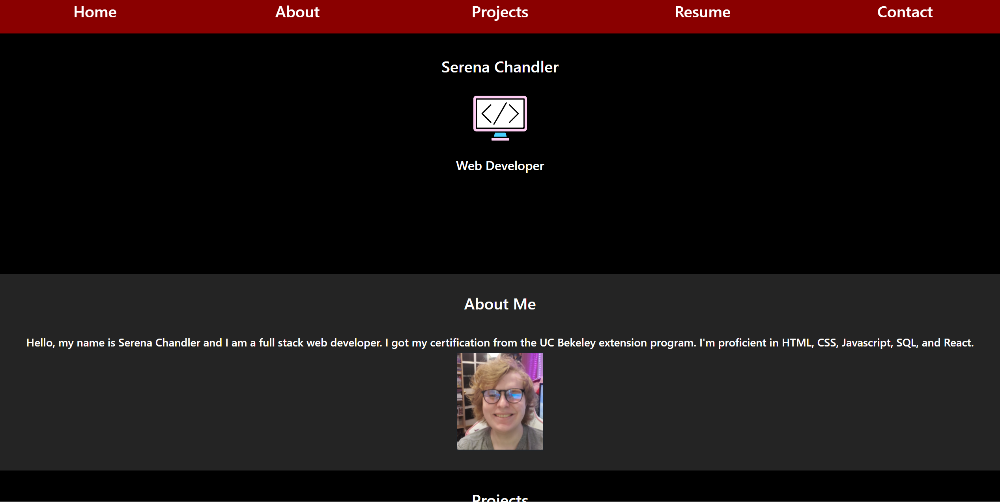

# React Portfolio

## Summary

A new build of my portfolio made with react

## Languages Used
-React

-React-Bootstrap

-Javascript
## Preview



## Code Snippets

Dynamically creating Cards for my past projects using react-bootstrap
```
      {projects.map((project) => (
          <Card
            className="col-sm-12 col-md-6 col-lg-4"
            style={{
              width: "24rem",
              borderWidth: 2,
              borderColor: "gold",
              border: "solid",
              borderRadius: 5,
              background: "grey",
              margin: "auto",
              marginTop: 10,
              paddingTop: 10,
            }}
          >
            <Card.Img
              style={{
                border: "solid",
                borderColor: "black",
                borderWidth: 2,
                borderRadius: 5,
              }}
              variant="top"
              src={project.image}
            />
            <Card.Body>
              <Card.Title>{project.title}</Card.Title>
              <Card.Text>{project.desc}</Card.Text>
              <a href={project.link} rel="noreferrer" target="_blank">
                <Button
                  style={{
                    background: "grey",
                    color: "black",
                    borderColor: "black",
                  }}
                  variant="primary"
                >
                  See Project
                </Button>{" "}
              </a>

              <a href={project.repo} rel="noreferrer" target="_blank">
                <Button
                  style={{
                    background: "grey",
                    color: "black",
                    borderColor: "black",
                  }}
                  variant="primary"
                >
                  See Repository
                </Button>{" "}
              </a>
            </Card.Body>
          </Card>
```

Creating a clickable button to download my resume
```
          <div>
            <h2>
              <a
                style={{ color: "white" }}
                className="text-decoration-none"
                href="./images/currentResume.pdf"
                target="_blank"
                download
              >
                click here to download
              </a>

              
            </h2>
          </div>
```


## my links
[Github](https://github.com/SerenaChandler)    
[Linkedin](https://www.linkedin.com/in/serena-chandler-b62a39204/)    
[Portfolio](https://serenachandlerportfolio.netlify.app/)
      